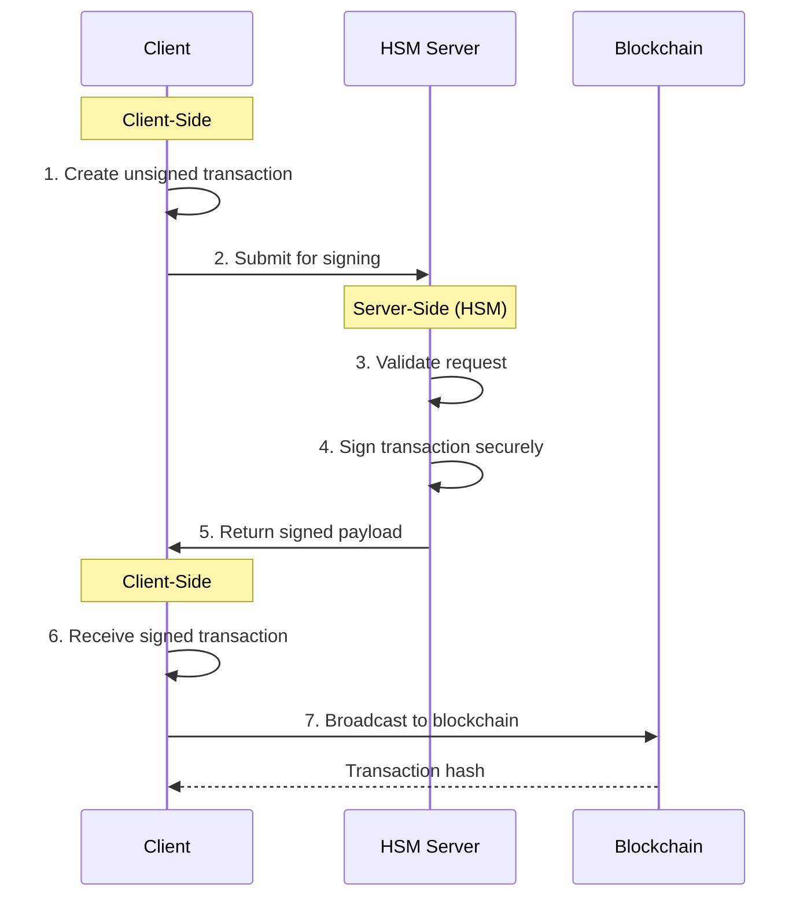

# **TXYZ**

TXYZ implements a custodial wallet standard with HSM-backed transaction signing via WebSocket, designed for secure key escrow scenarios and seamless service integrations. Combines institutional-grade security with exceptional developer experience.

## Enterprise-Grade Custody Features

- 🏛️ Certified key escrow architectures
- 🤝 Service-to-service integration patterns
- 🧩 Modular policy engine for compliance
- ⚡ Developer-first API design
- 🔋 Built on modern [viem](https://viem.sh) primitives

---

## **How It Works**




---

## **Installation**

```bash
# npm install txyz
# yarn add txyz
pnpm add txyz
```

---

## **Quick Start**

### 1. Initialize Client
```ts
import { createTxyzClient } from 'txyz';
import { websocket } from 'viem';

const txyz = createTxyzClient({
  transport: websocket('wss://eth.llamarpc.com')
  hsmWsEndpoint: 'wss://your-hsm.example.com',
  chain: 'mainnet',
});
```

### 2. Send Transaction
```ts
const txHash = await txyz.sendTx({
  abi: erc20Abi,
  to: '0xTokenAddress',
  functionName: 'transfer',
  args: ['0xRecipient', 1000n * 10n**18n], // BigInt literal
  from: '0xSenderAddress'
});

console.log('Transaction hash:', txHash);
```

---

## **HSM Server Setup**

### Basic Signing Endpoint
```ts
import WebSocket from 'ws';
import { privateKeyToAccount } from 'viem/accounts';

const wss = new WebSocket.Server({ port: 8080 });
const signer = privateKeyToAccount('0xYOUR_SECURE_KEY');

wss.on('connection', (ws) => {
  ws.on('message', async (message) => {
    try {
      const { id, unsignedTx } = JSON.parse(message.toString());
      const signedTx = await signer.signTransaction(unsignedTx);
      ws.send(JSON.stringify({ id, signedTx }));
    } catch (error) {
      ws.send(JSON.stringify({ error: 'Signing failed' }));
    }
  });
});

console.log('HSM WebSocket running on ws://localhost:8080');
```

---

## **Architecture**

| Component            | Responsibility                          |
|----------------------|-----------------------------------------|
| `TransactionBuilder` | Creates unsigned transactions           |
| `HSMClient`          | Handles secure HSM communication        |
| `TransactionSender`  | Broadcasts signed transactions          |

---

## **Security Best Practices**

- 🔒 Use certified HSMs in production
- 🚫 Never hardcode private keys
- 🔑 Implement key rotation policies
- 🔍 Audit all signing requests

---

## **Why TXYZ?**
- **Security-first**: Keys never leave HSM
- **Developer Experience**: Single `sendTx()` interface
- **Modular**: Compatible with any EVM chain
- **Extensible**: Supports custom signing providers

---

## **Contribution**
Contributions welcome! Please review our:
- [Code of Conduct](/CODE_OF_CONDUCT.md)
- [Contribution Guidelines](/CONTRIBUTING.md)

---

**License**: MIT  
**Maintainer**: Lucas Oliveira <olivmath@pm.me>
