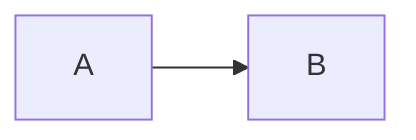

# **TXYZ**

TXYZ implements a custodial wallet standard with HSM-backed transaction signing via WebSocket, designed for secure key escrow scenarios and seamless service integrations. Combines institutional-grade security with exceptional developer experience.

## Enterprise-Grade Custody Features

🏛️ Certified key escrow architectures
🤝 Service-to-service integration patterns
🧩 Modular policy engine for compliance
⚡ Developer-first API design
🔋 Built on modern [viem](https://viem.sh) primitives

---

## **How It Works**





### Client-Side
1. Create unsigned transaction
2. Submit to HSM for signing
3. Receive again signed transaction
4. Broadcast to blockchain

### Server-Side (HSM)
1. Validate incoming request
2. Sign transaction securely
3. Return signed payload

---

## **Installation**

```bash
# npm install txyz
# yarn add txyz
pnpm add txyz
```

---

## **Quick Start**

### 1. Initialize Client
```ts
import { createTxyzClient } from 'txyz';
import { http } from 'viem';

const txyz = createTxyzClient({
  hsmUrl: 'ws://my-hsm-server.com',
  chain: 'mainnet',
  viemTransport: ws('ws://my-hsm-server.com')
});
```

### 2. Send Transaction
```ts
const txHash = await txyz.sendTx({
  abi: erc20Abi,
  to: '0xTokenAddress',
  functionName: 'transfer',
  args: ['0xRecipient', BigInt(1000 * 1e18)],
  from: '0xSenderAddress'
});
```

**Automated Flow:**  
① Create raw transaction → ② HSM signing → ③ Broadcast → ④ Return TX hash

---

## **HSM Server Setup**

### Basic Signing Endpoint
```ts
import express from 'express';
import { privateKeyToAccount } from 'viem/accounts';

const app = express();
app.use(express.json());

const secureSigner = privateKeyToAccount('0xYOUR_PRIVATE_KEY');

app.post('/sign', async (req, res) => {
  try {
    const signed = await secureSigner.signTransaction(req.body.unsignedTx);
    res.json({ signedTx: signed });
  } catch (error) {
    res.status(500).json({ error: 'Signing failed' });
  }
});

app.listen(3000, () => console.log('HSM active on port 3000'));
```

---

## **Architecture**

| Component            | Responsibility                          |
|----------------------|-----------------------------------------|
| `TransactionBuilder` | Creates unsigned transactions           |
| `HSMClient`          | Handles secure HSM communication        |
| `TransactionSender`  | Broadcasts signed transactions          |

---

## **Security Best Practices**

- 🔒 Use certified HSMs in production
- 🚫 Never hardcode private keys
- 🔑 Implement key rotation policies
- 🔍 Audit all signing requests

---

## **Why TXYZ?**
- **Security-first**: Keys never leave HSM
- **Developer Experience**: Single `sendTx()` interface
- **Modular**: Compatible with any EVM chain
- **Extensible**: Supports custom signing providers

---

## **Contribution**
Contributions welcome! Please review our:
- [Code of Conduct](/CODE_OF_CONDUCT.md)
- [Contribution Guidelines](/CONTRIBUTING.md)

---

**License**: MIT  
**Maintainer**: Lucas Oliveira <olivmath@pm.me>
