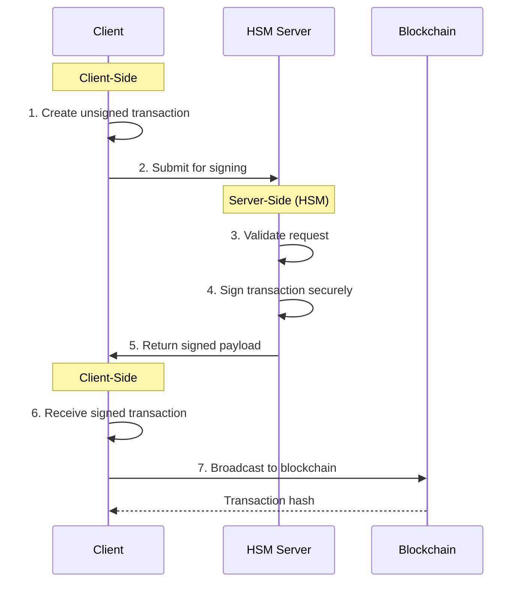

# **TXYZ**  

Enterprise-grade custodial wallet solution with HSM-backed transaction signing via WebSocket. Combines institutional security with developer-friendly APIs.

## **Table of Contents**
- [Features](#features)
- [Architecture Overview](#architecture-overview)
- [Installation](#installation)
- [Quick Start](#quick-start)
  - [1. Client Initialization](#1-client-initialization)
  - [2. Transaction Flow](#2-transaction-flow)
- [HSM Integration](#hsm-integration)
  - [HSM Server Setup](#hsm-server-setup)
- [Contributing](#contribution)
- [License](#license)

---

## **Features** <a name="features"></a>
- 🏛️ Certified key escrow architectures  
- 🤝 Service-to-service integration patterns  
- 🧩 Modular policy engine for compliance  
- ⚡ Developer-first API design  
- 🔋 Built on modern [viem](https://viem.sh) primitives  

---

## **Architecture Overview** <a name="architecture-overview"></a>



---

## **Installation** <a name="installation"></a>
```bash
# npm install txyz
# yarn add txyz
pnpm add txyz
```

---

## **Quick Start** <a name="quick-start"></a>

### 1. Client Initialization <a name="1-client-initialization"></a>
```ts
import { createTxyzClient } from 'txyz';
import { websocket } from 'viem';

const txyz = createTxyzClient({
  transport: websocket('wss://eth.llamarpc.com'),
  hsmWsEndpoint: 'wss://your-hsm.example.com',
  chain: 'mainnet',
});
```

### 2. Transaction Flow <a name="2-transaction-flow"></a>
```ts
const txHash = await txyz.sendTx({
  abi: erc20Abi,
  to: '0xTokenAddress',
  functionName: 'transfer',
  args: ['0xRecipient', 1000n * 10n**18n],
  from: '0xSenderAddress'
});
console.log('Transaction hash:', txHash);
```

---

## **HSM Integration** <a name="hsm-integration"></a>

### HSM Server Setup <a name="hsm-server-setup"></a>
```ts
import WebSocket from 'ws';
import { privateKeyToAccount } from 'viem/accounts';

const wss = new WebSocket.Server({ port: 8080 });
const signer = privateKeyToAccount('0xYOUR_SECURE_KEY');

wss.on('connection', (ws) => {
  ws.on('message', async (message) => {
    try {
      const { id, unsignedTx } = JSON.parse(message.toString());
      const signedTx = await signer.signTransaction(unsignedTx);
      ws.send(JSON.stringify({ id, signedTx }));
    } catch (error) {
      ws.send(JSON.stringify({ error: 'Signing failed' }));
    }
  });
});
```

---

## **Contributing** <a name="contribution"></a>
We welcome contributions! Please review:  
- [Code of Conduct](/CODE_OF_CONDUCT.md)  
- [Contribution Guidelines](/CONTRIBUTING.md)  

---

## **License** <a name="license"></a>
MIT © 2023  
Maintainer: Lucas Oliveira <olivmath@pm.me>
